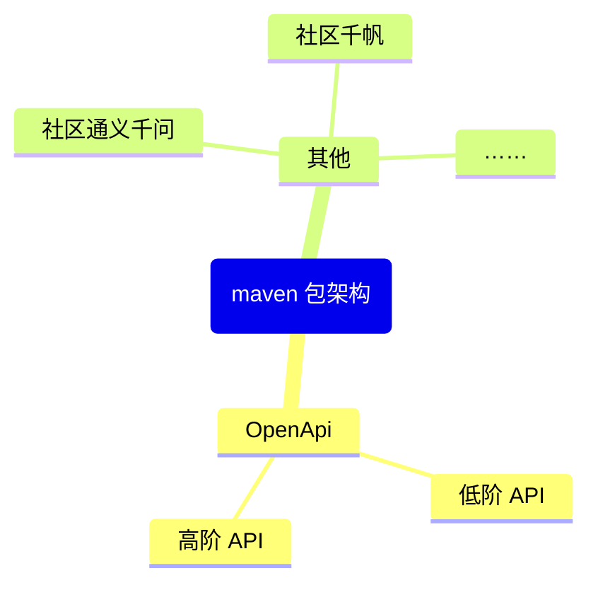

> [中文官网](https://docs.langchain4j.info/get-started)     [GitHub](https://github.com/langchain4j/langchain4j)   
>
> 三方总结的[尚硅谷](https://www.bilibili.com/video/BV1mX3NzrEu6)视频[笔记](https://www.cnblogs.com/timothy020/p/19043508)

# 基础篇

## 是什么

相当于 JDBC ，用于 java 服务和大模型交互的连接。


## 快速开始

LangChain 支持几乎市面全部的大模型供应商，如果不支持，可以使用 OpenAI 协议访问（大部分模型都支持 OpenAI ）。

国内主流的大模型平台：[阿里云百炼](https://bailian.console.aliyun.com/) 、硅基流动 等等。

后续的主要实战，通过 OpenAI + 阿里百炼 来举一反三。




### 百炼


- 本文获取的API Key
- Base URL：`https://dashscope.aliyuncs.com/compatible-mode/v1`
- 模型名称，如qwen-plus

```java
    @Bean(name = "bailianChatModel")
    public ChatModel bailianChatModel() {
        return OpenAiChatModel.builder().apiKey(System.getenv("BAILIAN_API_KEY"))
                .baseUrl("https://dashscope.aliyuncs.com/compatible-mode/v1")
                .modelName("qwen-plus")
                .build();
    }
```

```
```


