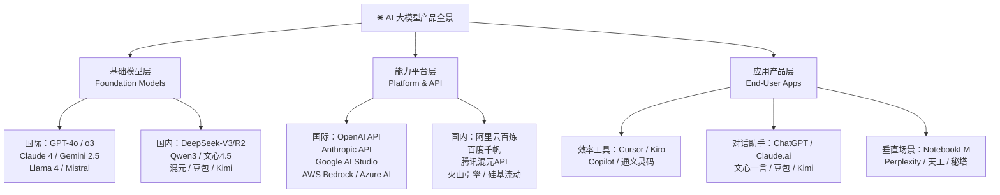
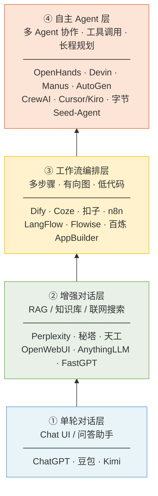
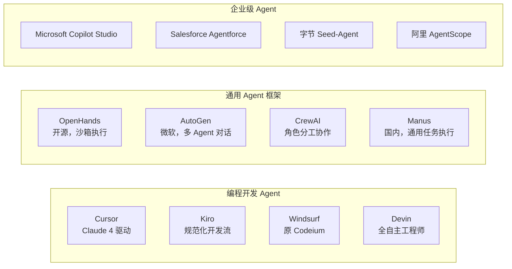
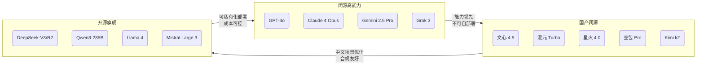
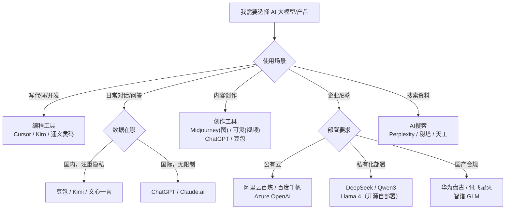

# 产品汇总

> 更新时间：2026-06-19

## 分层概览

AI 大模型产品按能力层次可分为三层：**基础模型层**（底层能力供应）、**能力平台层**（API/工具链/开发者服务）、**应用产品层**（面向终端用户的具体场景落地）。

---

## 一、基础模型层

基础模型是整个产业链的底座，提供原始智能能力，通常以 API 或开源权重形式对外输出。

### 1.1 国际主流基础模型

| 模型系列 | 厂商 | 最新版本（截至2026-06） | 特点 |
|---|---|---|---|
| GPT 系列 | OpenAI | GPT-4o、o3、o3-mini | 综合能力强，推理模型（o系列）擅长数学/代码 |
| Claude 系列 | Anthropic | Claude 4 Opus / Sonnet | 长上下文、安全对齐、代码能力突出 |
| Gemini 系列 | Google DeepMind | Gemini 2.5 Pro / Flash | 原生多模态，深度整合 Google 生态 |
| Llama 系列 | Meta | Llama 4 Scout / Maverick | 开源旗舰，支持本地部署 |
| Grok 系列 | xAI | Grok 3 | 实时联网，推理能力强 |

### 1.2 国内主流基础模型

| 模型系列 | 厂商 | 最新版本（截至2026-06） | 特点 |
|---|---|---|---|
| DeepSeek 系列 | 深度求索 | DeepSeek-V3 / R2 | 开源标杆，性价比极高，推理模型 R 系列影响深远 |
| Qwen（通义）系列 | 阿里巴巴 | Qwen3-235B / Qwen3-30B-A3B | MoE 架构，开源生态完善，多模态覆盖广 |
| 文心系列 | 百度 | 文心4.5 / ERNIE 4.5 Turbo | 中文理解强，深度融合百度搜索 |
| 混元系列 | 腾讯 | 混元 Turbo S | 长文本处理，视频生成能力强 |
| 豆包系列 | 字节跳动 | Doubao-Pro-256k | 超长上下文，多端落地快 |
| Kimi 系列 | 月之暗面 | Kimi k1.5 / k2 | 长文档处理，推理能力突出 |
| 星火系列 | 科大讯飞 | 讯飞星火 4.0 Ultra | 语音交互优势，教育垂直深耕 |
| MiniMax 系列 | MiniMax | MiniMax-Text-01 | 长上下文456K，视频生成 Hailuo |

---

## 二、能力平台层

平台层为开发者和企业提供模型调用、微调、部署、评测等工程化能力。

### 2.1 国际平台

| 平台 | 厂商 | 核心能力 |
|---|---|---|
| OpenAI Platform | OpenAI | GPT 全系 API，Fine-tuning，Assistants API，Batch API |
| Anthropic API | Anthropic | Claude API，Prompt Caching，Tool Use，Files API |
| Google AI Studio / Vertex AI | Google | Gemini API，多模态，企业级 SLA |

### 2.2 国内平台

| 平台 | 厂商 | 核心能力 |
|---|---|---|
| 阿里云百炼 | 阿里巴巴 | 多模型接入，RAG，Agent，模型微调，全链路 MLOps |
| 百度千帆 | 百度 | 文心系列 + 第三方模型，企业知识库，向量数据库 |
| 腾讯混元 API | 腾讯 | 混元模型，多模态，企业私有化部署 |
| 火山引擎方舟 | 字节跳动 | 豆包系列，大规模推理，低成本 |
| 硅基流动 SiliconFlow | 硅基流动 | 开源模型聚合，高性价比推理 API |
| 智谱 AI BigModel | 智谱 AI | GLM-4 系列，代码/图像/视频全栈 |

---

## 三、应用产品层

应用层按**交互复杂度与自主化程度**从低到高分为四级，越往上对模型能力要求越高，系统集成难度也越大。

### 3.1 单轮对话层（入门）

> 用户输入 → 模型直接返回，无外部工具、无记忆持久化，开箱即用。

| 产品 | 地区 | 依托模型 | 特点 |
|---|---|---|---|
| ChatGPT | 国际 | GPT-4o / o3 | 全球用户量最大，生态丰富 |
| Claude.ai | 国际 | Claude 4 Opus/Sonnet | 长文档分析，代码能力强 |
| Gemini | 国际 | Gemini 2.5 Pro | 深度整合 Google Workspace |
| 豆包 | 国内 | Doubao-Pro | 移动端体验好，字节生态 |
| Kimi | 国内 | Kimi k2 | 长文档处理，联网搜索 |
| 文心一言 | 国内 | 文心4.5 | 中文理解强，百度生态 |
| 讯飞星火 | 国内 | 星火4.0 Ultra | 语音交互，教育场景 |
| 天工 AI | 国内 | 天工3.0 | 多模态，实时联网 |

### 3.2 增强对话层（初级）

> 在对话基础上叠加**知识库检索（RAG）**、**联网搜索**或**文档解析**，回答质量更可控。用户无需编程，通过配置即可使用。

| 产品 | 地区 | 类型 | 特点 |
|---|---|---|---|
| Perplexity | 国际 | AI 搜索 | 引用来源清晰，学术/研究首选 |
| NotebookLM | 国际 | 知识整理 | Google 出品，播客/笔记生成 |
| Bing Copilot | 国际 | AI 搜索 | GPT-4o 驱动，微软生态 |
| 秘塔 AI 搜索 | 国内 | AI 搜索 | 无广告，学术友好 |
| OpenWebUI | 开源 | 知识库对话 | 自部署，支持多模型切换 |
| AnythingLLM | 开源 | RAG 对话 | 本地知识库，隐私保护 |
| FastGPT | 开源 | RAG 平台 | 国产开源，知识库管理完善 |
| 百度 AI 搜索 | 国内 | AI 搜索 | 流量最大，文心驱动 |

### 3.3 工作流编排层（中级）

> 通过**有向图/低代码**将多个节点（LLM 调用、工具、条件判断、循环）串联成业务流程，适合构建复杂的自动化任务，无需深度开发经验。

| 产品 | 地区 | 特点 |
|---|---|---|
| Dify | 开源/国际 | 工作流 + RAG + Agent 一体，生态最完善 |
| Coze / 扣子 | 国内（字节） | 国内最易上手，插件丰富，支持发布到多端 |
| 阿里云百炼 AppBuilder | 国内 | 企业级，深度整合阿里云服务 |
| n8n | 开源/国际 | 通用自动化，AI 节点 + 数百种 SaaS 集成 |
| LangFlow | 开源/国际 | LangChain 可视化，开发者友好 |
| Flowise | 开源/国际 | 轻量，Node.js 技术栈，本地部署方便 |
| 百度千帆 AppBuilder | 国内 | 文心驱动，政企场景合规 |
| 腾讯云 AI 应用平台 | 国内 | 混元驱动，对接微信生态 |

### 3.4 自主 Agent 层（高级）

> 模型具备**自主规划、工具调用、多步执行、错误恢复**能力，可在最少人工干预下完成复杂长程任务。多 Agent 协作是该层的核心特征。

| 产品 | 类型 | 自主程度 | 特点 |
|---|---|---|---|
| Devin | 编程 Agent | ⭐⭐⭐⭐⭐ | 端到端软件工程，自主调试部署 |
| OpenHands | 编程 Agent | ⭐⭐⭐⭐⭐ | 开源替代 Devin，沙箱安全执行 |
| Cursor / Kiro | 编程 Agent | ⭐⭐⭐⭐ | 人机协作为主，流行度高 |
| Manus | 通用 Agent | ⭐⭐⭐⭐⭐ | 国内首个通用 Agent，任务执行能力强 |
| AutoGen | Agent 框架 | ⭐⭐⭐⭐ | 微软出品，多 Agent 协作编排 |
| CrewAI | Agent 框架 | ⭐⭐⭐⭐ | 角色分工，适合流程模拟 |
| Microsoft Copilot Studio | 企业 Agent | ⭐⭐⭐ | 低代码构建企业 Agent，M365 深度集成 |
| 字节 Seed-Agent | 企业 Agent | ⭐⭐⭐⭐ | 字节内部孵化，工具调用能力强 |

---

## 四、能力对比全景图

按「**开放程度**」（闭源 API → 开源可自部署）和「**综合能力**」两个维度定位主流模型：

|  | 综合能力 ★★★★★ | 综合能力 ★★★★ | 综合能力 ★★★ |
|---|---|---|---|
| **闭源 API** | GPT-4o · Claude 4 Opus · Gemini 2.5 Pro | 文心4.5 · 混元Turbo · 星火4.0 | 360GPT · SenseChat |
| **半开放**（权重可下载） | DeepSeek-V3 · Qwen3-235B · Kimi k2 | 豆包Pro · MiniMax-Text | — |
| **完全开源** | Llama 4 · Mistral Large · DeepSeek-R2 | Qwen3-30B · Yi-Lightning | Phi-4 · Gemma 3 |

---

## 五、选型建议

# AI画图

https://www.cnblogs.com/yupi/p/18904399

[MCP Server 开发实战 | 大模型无缝对接 Grafana](https://www.cnblogs.com/alisystemsoftware/p/18826918)

[如何在通义灵码里使用 MCP 能力？](https://zhuanlan.zhihu.com/p/1905258684075976108)

