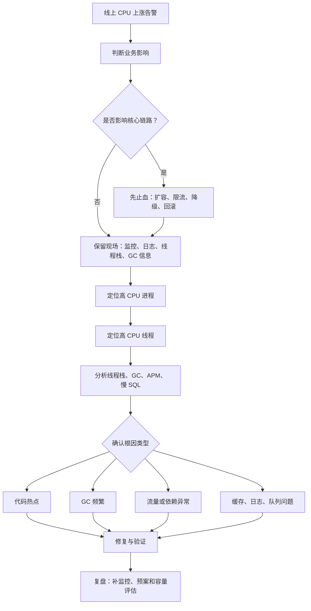
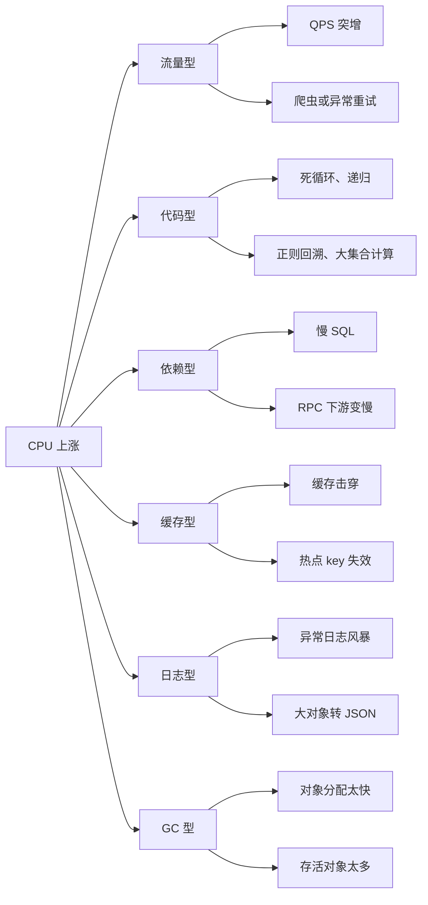
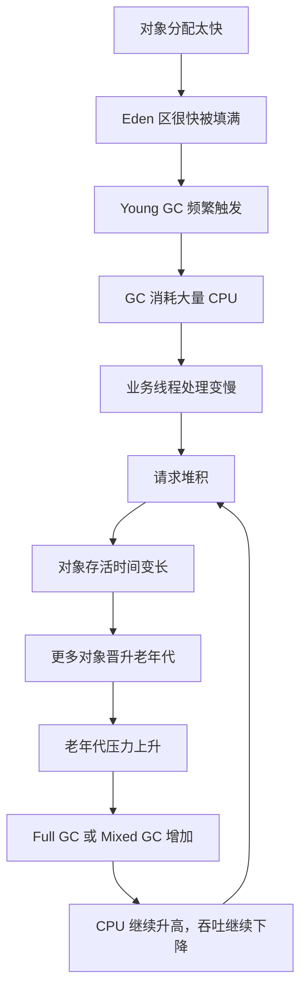
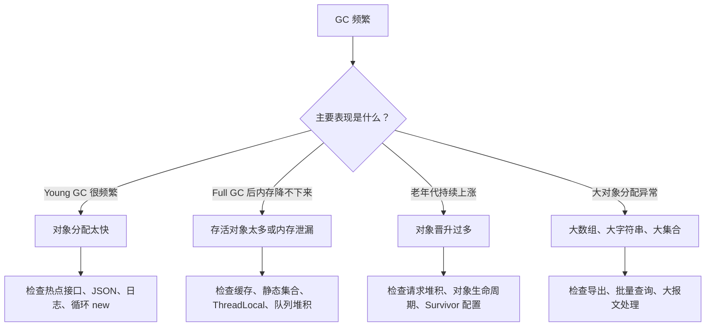
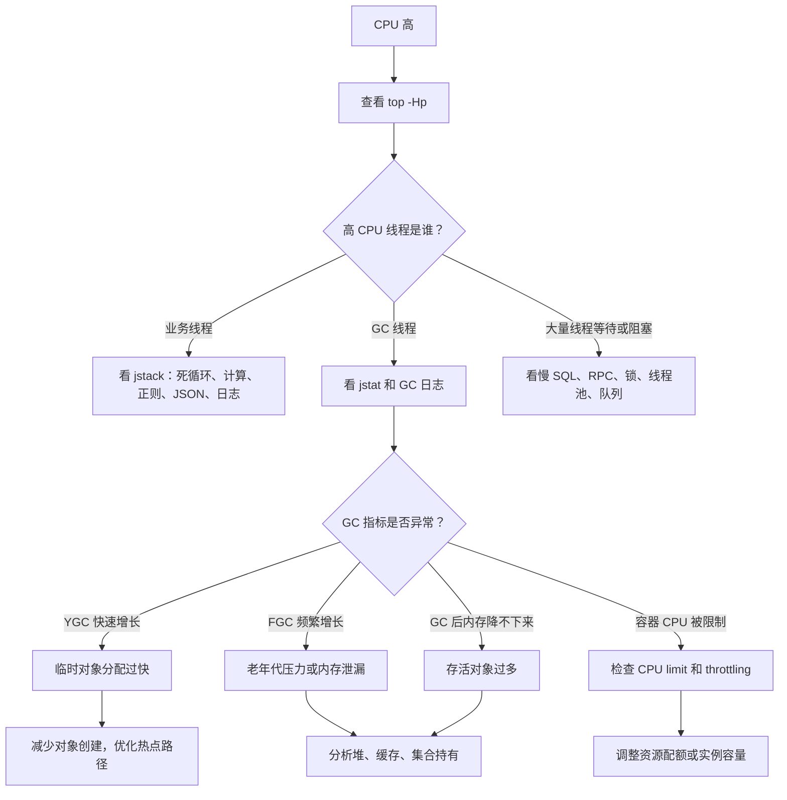
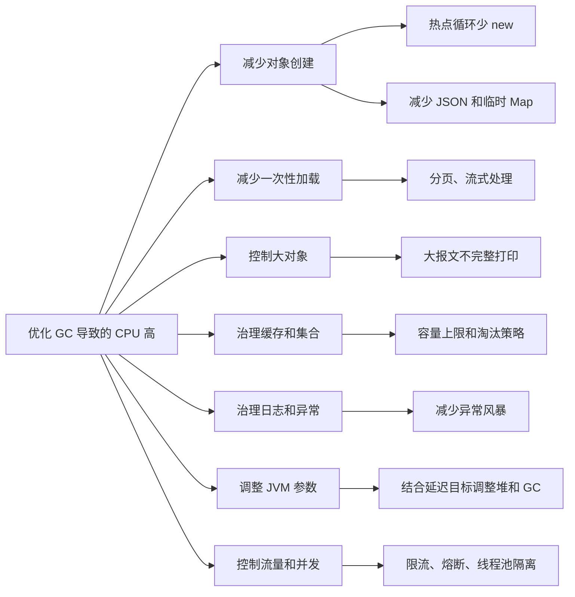

# 线上 CPU 上涨与 GC 频繁排查：从止血到定位的完整思路

线上 CPU 上涨是 Java 后端面试和真实生产环境中都非常常见的问题。它看起来只是一个机器指标异常，但背后可能是流量突增、代码死循环、慢 SQL、缓存失效、线程池堆积、日志暴涨，也可能是 GC 过于频繁导致 CPU 被垃圾回收器大量占用。

处理这类问题时，不建议一上来就盯着某个单点猜原因。更稳妥的方式是按“止血、定位、分析、修复、复盘”的顺序推进：先保证服务可用，再保留现场，最后用监控、线程栈、GC 日志和 profiler 找到真正热点。



## 一、线上 CPU 上涨时先做什么？

CPU 上涨后的第一目标不是立刻优化代码，而是判断业务是否已经受影响。

需要优先确认这些指标：

- 核心接口是否超时。
- 错误率是否上升。
- P95、P99 响应时间是否变差。
- QPS 是否突增。
- 队列是否堆积。
- 实例是否频繁重启。
- 容器是否出现 CPU throttling。
- 最近是否有发布、配置变更或流量活动。

如果已经影响线上服务，应先止血：

- 能扩容先扩容，增加实例或临时升配。
- 如果刚发布新版本，优先考虑回滚。
- 如果是异常流量，先做限流、封禁、降级或熔断。
- 如果是单个实例异常，可以先摘除流量。
- 如果必须重启，重启前尽量保留线程栈、GC 信息和监控截图。

线上排障要避免一个误区：看到 CPU 高就直接重启。重启可能短暂恢复，但也会把现场清掉。如果问题来自代码、流量或缓存击穿，重启之后通常还会再次出现。

## 二、如何快速定位是谁在消耗 CPU？

进入机器后，先找出 CPU 占用最高的进程：

```shell
top
ps -eo pid,ppid,cmd,%cpu,%mem --sort=-%cpu | head
```

如果是 Java 进程，可以进一步查看进程内哪个线程最忙：

```shell
top -Hp <pid>
```

找到高 CPU 线程 ID 后，将线程 ID 转成 16 进制：

```shell
printf "%x\n" <tid>
```

然后抓取 Java 线程栈：

```shell
jstack <pid> > jstack.txt
```

在 `jstack.txt` 中搜索刚才转换后的 16 进制线程 ID，就可以看到该线程正在执行什么代码。

如果高 CPU 线程一直停留在业务方法里，可能是死循环、复杂计算、大集合遍历、正则回溯、JSON 序列化等问题。

如果线程栈里大量线程处于数据库、RPC、锁等待或队列消费相关位置，CPU 高可能只是表象，还需要结合慢 SQL、线程池、连接池和下游服务继续分析。

如果高 CPU 主要消耗在 GC 线程上，就要重点检查 GC 是否异常频繁。

## 三、CPU 上涨的常见原因

线上 CPU 变高通常有以下几类原因。

第一类是流量型问题。比如促销活动、爬虫、异常客户端重试、上游服务放量，都会让请求量突然增加。即使代码没有变化，CPU 也可能被打满。

第二类是代码型问题。典型场景包括死循环、递归无法收敛、复杂正则灾难回溯、循环中频繁创建对象、大集合排序、Stream 滥用、parallelStream 抢占公共线程池等。

第三类是依赖型问题。比如数据库慢查询、Redis 超时、RPC 下游变慢，可能导致线程堆积、重试风暴和更多对象存活，最终间接推高 CPU。

第四类是缓存型问题。缓存大面积失效、热点 key 过期、缓存击穿，会让原本很轻的请求突然打到数据库或复杂计算逻辑上。

第五类是日志型问题。异常日志大量打印、复杂对象转 JSON、频繁打印大报文，都会消耗 CPU 和 IO，同时制造大量临时对象，进一步增加 GC 压力。

第六类就是 GC 型问题。程序创建对象太快，或者存活对象太多，导致垃圾回收器反复工作。此时 CPU 很高，但业务吞吐反而下降，因为 CPU 被用来回收内存，而不是处理请求。



## 四、为什么 GC 频繁会导致 CPU 变高？

GC 不是免费的。垃圾回收器运行时，需要做一系列 CPU 密集型工作。

它需要从 GC Roots 开始扫描对象引用，例如线程栈、静态变量、本地方法引用等。然后沿着引用链追踪对象图，判断哪些对象仍然存活，哪些对象已经可以回收。

存活对象需要被标记，垃圾对象需要被清理。有些垃圾回收器还会整理内存，把对象移动到更连续的区域，以减少内存碎片。对象一旦移动，相关引用也需要更新。

这些操作都会消耗 CPU。

所以当 GC 很频繁时，CPU 会被大量用在“内存管理”上。业务线程能拿到的 CPU 时间变少，请求处理速度下降，响应时间变长，请求开始堆积。请求堆积后，对象存活时间可能变长，更多对象进入老年代，GC 又会变得更困难。

这个过程很容易形成恶性循环：



因此，GC 导致的 CPU 高有一个典型特征：机器看起来很忙，但业务处理能力下降。也就是说，CPU 并不是有效地用在业务计算上，而是在反复扫描、标记、清理和整理对象。

## 五、哪些情况会导致 GC 频繁？

常见原因包括：

- 短时间创建了大量临时对象。
- 循环中频繁 `new` 对象、创建集合、拼接字符串。
- 大量 JSON 序列化和反序列化。
- 日志打印大对象、大报文或大量异常堆栈。
- 一次查询加载过多数据。
- 大对象频繁分配，比如大数组、大字符串、大集合。
- 缓存对象太多，老年代占用持续升高。
- 内存泄漏导致 Full GC 后堆内存仍然降不下来。
- 堆设置太小，稍微分配一些对象就触发 GC。
- 请求量突增，对象分配速率明显上升。
- 线程池、队列或连接池堆积，导致对象存活时间变长。

这里要区分两种情况。

一种是“对象分配太快”。比如某个接口 QPS 很高，每次请求都会创建大量临时 DTO、Map、JSON 字符串。对象大部分很快死亡，但因为分配速度太快，Young GC 会非常频繁。

另一种是“存活对象太多”。比如缓存无上限、静态集合持有对象、ThreadLocal 未清理、队列堆积。此时 GC 即使执行了，也回收不了多少内存，老年代持续上涨，最后可能触发 Full GC。

前者重点看对象分配速率，后者重点看 Full GC 后内存是否明显下降。



## 六、如何判断 CPU 高是不是 GC 引起的？

可以先用 `jstat` 看 GC 情况：

```shell
jstat -gcutil <pid> 1000 10
```

重点关注：

- `YGC` 是否增长很快。
- `YGCT` 是否持续增加。
- `FGC` 是否频繁增长。
- `FGCT` 是否很高。
- `GCT` 占进程运行时间的比例是否异常。
- 老年代使用率是否持续升高。
- Full GC 后老年代是否降不下来。

也可以查看堆信息：

```shell
jcmd <pid> GC.heap_info
jcmd <pid> GC.class_histogram
```

如果需要看存活对象分布，可以使用：

```shell
jmap -histo:live <pid>
```

但线上执行 `jmap -histo:live` 要谨慎，因为它可能触发 Full GC，影响服务。生产环境更推荐优先使用 APM、GC 日志、JFR 或 async-profiler。

如果启用了 GC 日志，可以重点看：

- GC 触发频率。
- 每次 GC 耗时。
- GC 前后堆内存变化。
- Young GC 是否频繁。
- Full GC 是否出现。
- 是否存在 promotion failed、to-space exhausted、humongous allocation 等异常信号。

如果使用容器，还要看 CPU limit 和 throttling。容器 CPU 配额太小的时候，GC 线程和业务线程会争抢有限 CPU，表现出来也可能是 CPU 高、RT 抖动、吞吐下降。



## 七、GC 频繁导致 CPU 高时怎么优化？

优化方向不是简单地“让 GC 更努力”，而是减少 GC 的工作量。

首先减少对象创建。热点循环中避免无意义地创建临时对象，字符串拼接使用局部 `StringBuilder`，高频路径避免反复创建大 Map、大 List、大 DTO。

其次减少一次性加载数据。分页查询、流式处理、限制导出数量，避免一次查出几十万条数据放进内存。

第三是控制大对象。大字符串、大数组、大 JSON 报文容易直接进入老年代，甚至触发特殊分配逻辑。对大报文要尽量流式处理，日志中也不要完整打印。

第四是检查缓存和集合。缓存要有容量上限、过期策略和淘汰策略。静态 Map、单例对象、ThreadLocal、队列等都要检查是否长期持有无用对象。

第五是治理日志和异常。异常风暴不仅影响磁盘 IO，也会创建大量异常对象和堆栈字符串。高频异常应减少重复打印，并从根因上消除异常。

第六是调整 JVM 参数。堆太小会导致 GC 频繁，堆太大又可能增加单次 GC 成本。需要根据对象分配速率、存活对象大小、延迟目标和机器资源调整堆大小以及 GC 策略。

第七是控制流量和并发。限流、熔断、线程池隔离、队列长度限制都可以防止请求无限堆积，避免对象存活时间被拉长。



## 八、一个面试中可以直接复述的回答

如果面试官问“线上 CPU 上涨怎么处理”，可以这样回答：

> 我会先判断业务影响面，看核心接口 RT、错误率、QPS、实例健康和最近发布。如果已经影响服务，先扩容、限流、降级或回滚，保证服务可用。然后保留现场，通过 `top` 找到高 CPU 进程，通过 `top -Hp` 找到高 CPU 线程，再用 `jstack` 对应线程栈定位具体代码。如果线程在业务方法里，就看是否有死循环、复杂计算、正则、JSON、日志或大集合操作；如果 CPU 主要消耗在 GC 线程，就结合 `jstat`、GC 日志、堆信息和对象分布判断是不是 GC 频繁。最后根据根因处理，比如优化热点代码、减少对象创建、治理慢 SQL、恢复缓存、调整线程池或 JVM 参数。

如果面试官继续问“GC 频繁为什么会导致 CPU 高”，可以这样回答：

> 因为 GC 本身需要消耗 CPU。垃圾回收器要从 GC Roots 开始扫描对象引用，标记存活对象，清理垃圾对象，有些收集器还要整理内存和更新引用。如果对象分配速度很快，或者存活对象很多，GC 就会频繁触发。CPU 大量花在扫描、标记、清理和整理对象上，业务线程拿到的 CPU 时间减少，吞吐下降，请求堆积，更多对象存活更久，最终可能导致 GC 更频繁。这就是为什么 GC 频繁时会看到 CPU 高但业务处理能力下降。

## 九、总结

线上 CPU 上涨不是一个单独的 JVM 问题，而是一个完整的生产排障问题。处理时要先保证服务可用，再定位高 CPU 进程和线程，结合线程栈、GC 指标、日志、APM、数据库和缓存监控一起判断。

GC 频繁导致 CPU 变高的本质，是 CPU 被垃圾回收器大量占用。根因通常是对象分配太快、存活对象太多、堆设置不合理、流量突增、缓存失效或队列堆积。

真正有效的优化，不是盲目调 GC 参数，而是降低对象分配速率，减少无效存活对象，控制请求并发，避免依赖雪崩，并让系统在高压下仍然有清晰的限流、降级和隔离能力。
